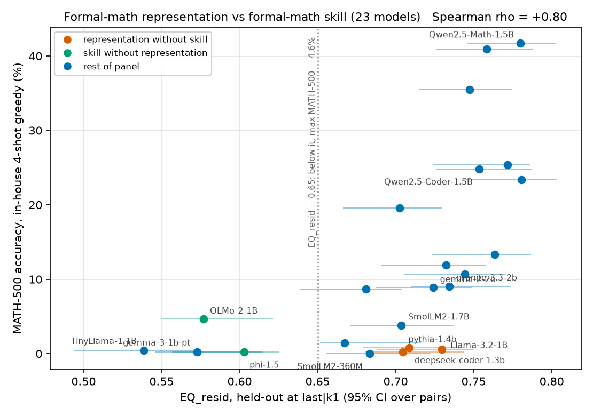

# Representation of Equivalent Math as Math-Capability Predictors

Does the geometry of an LLM's internal representation of **mathematically equivalent
statements** predict its mathematical capability — and, more sharply, its robustness to
equivalent reformulations?

## Status: Phase 3 complete — 23 models, 12 families, construct-matched DV. Necessity without sufficiency.

| document | contents |
|---|---|
| [`REPORT.md`](REPORT.md) | **preliminary technical report** — the self-contained write-up of everything below |
| [`PLAN.md`](PLAN.md) | full design: hypotheses, panel, statistics, falsification criteria, compute budget |
| [`METRICS.md`](METRICS.md) | what EQ is, why the statistic is valid, where its validity breaks, and how to read a result |
| [`results/PHASE0.md`](results/PHASE0.md) | Phase 0: the lexical-null finding and the dissociation predictions |
| [`results/PHASE05.md`](results/PHASE05.md) | Phase 0.5: dissociated 10-model panel, lexically-controlled metrics, in-house GSM8K, metric-selection verdict |
| [`results/PHASE1_SPECIFICITY.md`](results/PHASE1_SPECIFICITY.md) | Phase 1: the specificity 2×2 — EQ_resid predicts math capability, its paraphrase mirror predicts nothing, the two are uncorrelated |
| [`results/PHASE2_PANEL20.md`](results/PHASE2_PANEL20.md) | Phase 2: 20 models / 10 families — replication (+0.69), the representation/skill double dissociation, control tuning arms, protocol hardening |
| [`results/PHASE3_MATH500.md`](results/PHASE3_MATH500.md) | Phase 3: 23 models / 12 families — MATH-500 resolves the dissociation; necessity-without-sufficiency wedge |
| [`RELATED_WORK.md`](RELATED_WORK.md) | prior work, mapped to the design decision each one justifies or threatens |

### Headline finding

On 23 models across 12 families (0.36–2.6B), `EQ_resid` — anchor-AUROC on MELD
equivalence pairs after partialling out TF-IDF cosine — is a lexically-controlled,
math-specific, size-independent meter of **formal-mathematics representation**, and
on this panel that representation is **necessary but not sufficient** for formal-math
skill:

- `rho(EQ_resid, MATH-500 in-house) = +0.797` (p < 0.0001; non-Qwen-only +0.56),
  beating the word-problem DV (`GSM8K +0.695`); partials show the GSM8K relation is
  entirely mediated by formal-math ability (`+0.556` vs `−0.139`).
- **Necessity wedge**: every model with EQ_resid < 0.65 floors on MATH-500 (≤ 4.6%);
  above it, skill ranges 0–42% — the sufficiency gap is where skill training lives
  (pythia-1.4b, deepseek-coder-1.3b, Llama-3.2-1B hold the representation with ~zero
  skill).
- Specificity holds both ways: EQ_resid ignores ARC-Easy and its paraphrase mirror;
  gemma-3-1b-pt (panel-high general ability, no math) sits at the representation
  floor. At fixed 1.54B, math tuning raises EQ_resid, coder tuning lowers it.



**Metric selected for scaling: `EQ_resid`** — anchor AUROC after partialling the
TF-IDF cosine out of the model cosine (null = 0.5 by construction, all anchors kept,
most stable ordering, strongest capability tracking), with `eq_hard` as the strict
audit. Raw EQ must always be read against the lexical baseline **0.7715**
(pinned: TF-IDF `char_wb` 3-5gram, `src/lexical.py`).

Both base→math pairs at identical parameter count point the predicted way on every
metric variant (Qwen2.5 and Qwen2 pairs; the effect *grows* under lexical control).

### What is still open

H2 — that equivalence representation predicts robustness to equivalent reformulations
better than raw accuracy — is untested: the rewrite-invariance arm has not run, and
the necessity wedge gives it two-sided advance predictions. H3 (causal ablation of the
equivalence subspace) has not started. H1-style claims remain correlational; the
lexical control is statistical (EQ_resid is a lower bound) with `eq_hard` as the
by-construction audit, and purpose-built topic-matched negatives are still the
stronger fix. The necessity threshold (0.65) is descriptive on 23 points, not a fitted
boundary.

## Running it

```bash
python -m tests.test_extract      # padding-invariance guard
python -m tests.test_parity       # fp32-GPU vs fp64-CPU parity
python -m src.run_panel           # extract + all metric variants, full panel
python -m src.eval_gsm8k          # in-house word-problem axis (5-shot greedy)
python -m src.eval_math500        # in-house formal-math axis (4-shot greedy, boxed)
python -m src.eval_arc            # in-house non-math axis (logprob, no generation)
python -m src.specificity         # PARA metric on PAWS (language-side mirror)
python -m src.analyze             # tables: tracking, jackknife, calibration, pairs
python -m src.analyze_spec        # specificity 2x2 + MATH-500 triangulation
python -m src.figures && python -m src.figures_spec && python -m src.figures_math
python -m src.run_pilot           # (Phase 0 pipeline, kept for reproducibility)
```

Hardware: Phase 0 on a single RTX 3070 (8 GB); Phases 0.5–3 on a single RTX 5090
(32 GB). Extraction 1–3 s/model and metrics ~25 s/model; GSM8K ~2–4 min/model;
MATH-500 ~3–6 min/model. Note bf16 hidden states differ across GPU generations at the
third decimal — never mix EQ numbers extracted on different machines. Activations
cache to `results/raw/` (gitignored, ~7 GB for 23 models × two stimulus sets).

Data: [`uw-math-ai/MELD-dataset`](https://huggingface.co/datasets/uw-math-ai/MELD-dataset)
— 270 equivalent pairs across 18 framings, plus 541 framing-matched hard negatives.

**Raw data archive:** all hidden-state activation caches (36 GB, fp32, bit-exact
inputs to every reported number), per-item model generations for GSM8K/MATH-500,
ARC-Easy option logprobs, and aggregate results are public at
[`toolazyhhh123/representation-of-equivalent-math-raw`](https://huggingface.co/datasets/toolazyhhh123/representation-of-equivalent-math-raw).

## License

Apache-2.0 (see [`LICENSE`](LICENSE)). The bundled MELD data (`data/meld/`) is
redistributed under its own Apache-2.0 license from
[uw-math-ai/MELD-dataset](https://huggingface.co/datasets/uw-math-ai/MELD-dataset).
