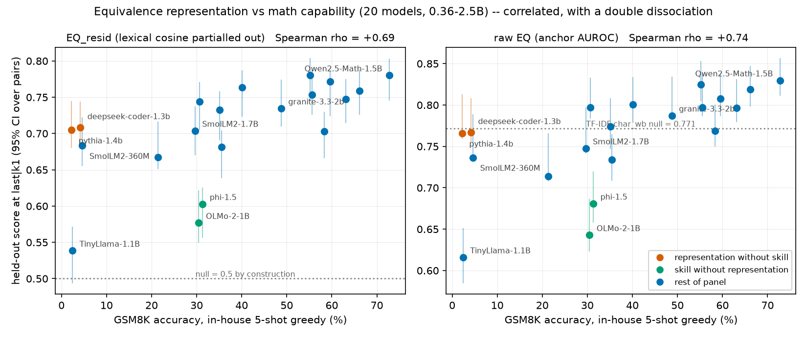

# Representation of Equivalent Mathematics Predicts Math Capability, Not Model Size

**⚠️ PRELIMINARY TECHNICAL REPORT — v0.1, 2026-08-20.**
*This is an early-stage result on a 10-model panel, shared to establish priority and
invite critique. The limitations in §7 are load-bearing: the headline correlation is
robust within this panel, but the panel is small, family-imbalanced, and the
specificity control (§7.1) has not yet been run. Do not cite the quantitative claims
as settled.*

**Author:** Ian ([@toolanzyhhh1234](https://github.com/toolanzyhhh1234))
**Repository:** all code, data pointers, per-model results, and the analysis pipeline
are in this repository; every number in this report regenerates from four commands (§8).

---

## Abstract

Does the geometry of a language model's internal representations of *mathematically
equivalent statements* predict its mathematical capability? We measure, for ten
open-weight models (0.36B–1.7B parameters), how well hidden-state cosine similarity
distinguishes 270 cross-dialect equivalent theorem pairs (MELD) from 541
framing-matched hard negatives, and relate that score to GSM8K accuracy measured
in-house under one fixed harness. Two findings. **First, a methodological one:** a
character n-gram TF-IDF with no neural network scores 0.7715 on this benchmark
(anchor-AUROC), so results on MELD-style tasks reported against chance (0.5) are badly
overstated, and the dataset's hard negatives control for mathematical *framing* but
not for *topic*. We construct lexically-controlled variants of the metric — chiefly
`EQ_resid`, the anchor-AUROC after partialling the TF-IDF cosine out of the model
cosine, whose null is 0.5 by construction. **Second, the substantive one:** on a panel
built so that parameter count and math capability decorrelate (Spearman +0.23),
equivalence representation tracks capability, not size: ρ(`EQ_resid`, GSM8K) = +0.818
(permutation p = 0.005) versus ρ(`EQ_resid`, log params) = +0.250 (p = 0.49); partial
correlations +0.807 versus +0.109. A point prediction pre-registered before the
deciding model was run resolved in favour of capability: SmolLM2-1.7B (a large model
with mid math ability) was predicted at EQ 0.770 under the capability hypothesis and
0.808 under the size hypothesis; observed 0.748 (95% CI [0.742, 0.796], excluding the
size prediction). Both base→math-tuned pairs at identical parameter count
(Qwen2.5-1.5B and Qwen2-1.5B families) shift positively on every metric variant, and
the effect grows rather than shrinks under lexical control.

---

## 1. Introduction

A model's mathematical competence is usually measured behaviourally, by benchmark
accuracy. But benchmark scores are famously fragile to equivalent reformulations of
the same problem, which suggests a representational question underneath: does a
capable model *represent* two formulations of one mathematical fact as the same thing?
If the degree of that representational identification could be read cheaply from
hidden states — forward passes over a few hundred fixed stimuli, no generation, no
benchmark contamination concerns — it would be a useful capability proxy, and more
importantly a handle on *robustness*: the mechanistically motivated claim is not
"geometry predicts accuracy" but "geometry predicts invariance to reformulation."

The literature approaches this from two sides without closing the loop. Work on
equivalence in embedding space (MELD; format-agnostic reasoning subspaces) measures
the geometry but not capability. Work on reformulation fragility (miniF2F-rw,
GSM-Symbolic) measures capability without opening the model. This report is a first
attempt to connect them across models, at small scale, with the failure modes
controlled as carefully as we know how.

This phase answers the instrument question — *which* representational metric is valid
and worth scaling — and one substantive question: whether the signal tracks capability
or just model size. It does not yet test the robustness hypothesis (§7.4).

## 2. Data and metric

### 2.1 Stimuli

[MELD](https://huggingface.co/datasets/uw-math-ai/MELD-dataset) (uw-math-ai): 270
theorem pairs, each stating one mathematical fact in two different subfield dialects
("framings", e.g. vector-space vs module-theory language), across 9 domains and 18
framings, plus 541 hard negatives per-framing — statements lexically close to true
statements in that framing but mathematically wrong (a quantifier weakened, `injective`
swapped for `surjective`).

### 2.2 The base metric: anchor-wise AUROC ("EQ")

For each pair (a, b) and each direction, the anchor's cosine to its true partner is
ranked against its cosines to all distractors *in the partner's framing*; the
per-anchor AUROC is the fraction of distractors ranked below the partner (ties 0.5),
and EQ is the mean over 540 anchors. Hidden states are taken per layer under last-token
and mean pooling; anisotropy is corrected per model per layer (centering plus top-k PC
removal or ZCA whitening) before any cosine, since uncorrected anisotropy correlates
with scale and would manufacture the confound we are testing for. The reported layer is
chosen on one half of the stimuli (domain-stratified) and the score reported on the
other half, so no number is a max over ~30 layers. Numerical guards: padding-invariance
of extraction (min cos ≥ 0.9999), fp32-GPU/fp64-CPU parity (ΔEQ ≤ 1.2e-4).

### 2.3 The null is a lexical baseline, not 0.5

A TF-IDF over character 3–5-grams (sklearn `char_wb`) with no neural network scores
**EQ = 0.7715**. The reason: MELD's distractors are matched to the *target's framing*
but not to the *anchor's topic* — a true pair restates one concept and therefore shares
topic-specific tokens across dialects, while distractors concern different concepts.
Lexical overlap remains a usable signal, contrary to the dataset card's description.
Consequently EQ as published-style "AUROC vs chance" mixes equivalence detection with
topical lexical matching, and every raw EQ number in this report is read against
0.7715, not 0.5.

### 2.4 Lexically-controlled variants

| variant | construction | null |
|---|---|---|
| `EQ` | anchor AUROC, unchanged | TF-IDF = 0.7715 |
| `EQ_resid` | AUROC of `model_cos − b·tfidf_cos`, b fit per model/layer/correction over all candidate scores | **0.5 by construction** |
| `EQ_hard` | AUROC against only the negatives at least as lexically close to the anchor as the true partner | 0.5; TF-IDF itself scores **0.0**. Covers 71% of anchors, ~10 negatives each |
| `EQ_lextop` | AUROC against each anchor's 5 lexically closest negatives | TF-IDF = 0.4656 |

`EQ_resid` carries a known bias that must travel with it: equivalent statements
*legitimately* share vocabulary, so partialling TF-IDF out removes genuine signal along
with the artifact. Residual scores are therefore **lower bounds** (false-negative
biased); we observe the over-correction directly at layer 0, where `EQ_resid` sits
below its null (0.23–0.39). `EQ_hard` is the complementary control — it repairs the
comparison set instead of subtracting from the measurement — at the price of coverage.
When the two disagree, the restriction is the one to trust.

### 2.5 Capability axis, measured in-house

Published GSM8K numbers for the same model differ by up to 7 points across harnesses,
so capability is measured in-house under one pinned harness for all models: 5-shot
(exemplars = first five GSM8K train items), plain completion format, greedy decoding,
max 256 new tokens, full 1319-item test set, answer = the `#### n` field else the last
number. The three models with published same-harness numbers agree with ours to
1.4–1.7 points.

## 3. Panel design

Ten models, 0.36B–1.7B, uniform bf16, chosen so size and capability come apart:

| model | params (B) | GSM8K (in-house) | role |
|---|---|---|---|
| SmolLM2-360M | 0.36 | 4.6 | small, weak |
| Qwen2.5-0.5B | 0.49 | 35.1 | small, mid |
| Qwen3-0.6B | 0.60 | 40.1 | small, mid |
| TinyLlama_v1.1 | 1.10 | 2.4 | **large, no math** |
| Falcon3-1B-Base | 1.67 | 30.6 | large, mid |
| SmolLM2-1.7B | 1.71 | 29.6 | **largest, mid — pre-registered test point** |
| Qwen2-1.5B | 1.54 | 58.3 | base of pair 2 |
| Qwen2-Math-1.5B | 1.54 | 63.2 | math-tuned, same size |
| Qwen2.5-1.5B | 1.54 | 59.6 | base of pair 1 |
| Qwen2.5-Math-1.5B | 1.54 | 72.8 | math-tuned, same size |

Achieved decorrelation: Spearman(GSM8K, log params) = **+0.23** (the earlier 5-model
pilot had +0.975, making cross-model claims unidentifiable — that pilot is why this
panel exists).

**Pre-registration.** Before SmolLM2-1.7B was ever run, the Phase 0 analysis
(committed in `results/PHASE0.md`, git history verifiable) derived two point
predictions for it from the two competing hypotheses: EQ(last-token, k=1) ≈ **0.770**
if EQ tracks capability (from a margin–capability fit), ≈ **0.808** if EQ tracks size
(from its parameter count). The gap, 0.038 AUROC, exceeds the metric's measurement
noise.

## 4. Results



### 4.1 Capability, not size

Across the panel (held-out scores at the pre-registered setting, last-token pooling,
k=1 PC removed; permutation p over 20k shuffles):

| variant | ρ(GSM8K) | p | ρ(log params) | p | ρ(cap∣size) | ρ(size∣cap) |
|---|---|---|---|---|---|---|
| EQ | +0.806 | 0.006 | +0.238 | 0.52 | +0.795 | +0.089 |
| **EQ_resid** | **+0.818** | **0.005** | +0.250 | 0.49 | **+0.807** | +0.109 |
| EQ_hard | +0.648 | 0.047 | −0.044 | 0.91 | +0.678 | −0.262 |
| EQ_lextop | +0.794 | 0.008 | +0.206 | 0.58 | +0.784 | +0.038 |

A leave-one-family-out jackknife keeps ρ(EQ_resid, GSM8K) in [+0.74, +1.00] under
every family drop — the result is not driven by any one family, including Qwen (6 of
10 models).

### 4.2 The pre-registered point

SmolLM2-1.7B observed: **0.748** held-out, 0.769 full-set, bootstrap 95% CI
**[0.742, 0.796]** — the CI excludes the size prediction (0.808) and contains the
capability prediction (0.770).

### 4.3 The dissociating models

TinyLlama-1.1B — bigger than half the panel, GSM8K 2.4 — scores *below* the lexical
baseline on raw EQ (0.616) and at the null of every controlled variant (EQ_resid 0.538,
CI [0.494, 0.571]; EQ_hard 0.506). Its mean-pooled *embedding layer* alone scores 0.768
raw — a bag of input embeddings nearly matches TF-IDF, which is the lexical leak of
§2.3 made vivid; the controlled variants collapse exactly that.

Conversely SmolLM2-360M (GSM8K 4.6) sits below the raw-EQ lexical baseline yet scores
EQ_resid 0.683 ≫ 0.5: it carries real non-lexical equivalence signal while lacking the
capability to out-rank a strong lexical scorer. Representation quality and execution
ability dissociate at the bottom of the scale; only TinyLlama has neither. "Below the
lexical baseline" and "no equivalence signal" are different claims, and only the
residual metric separates them.

### 4.4 Math-tuning at fixed size

Base → math-tuned at identical parameter count, held-out:

| pair | EQ | EQ_resid | EQ_hard | EQ_lextop |
|---|---|---|---|---|
| Qwen2.5-1.5B → Qwen2.5-Math-1.5B | +0.022 | +0.008 | +0.014 | +0.004 |
| Qwen2-1.5B → Qwen2-Math-1.5B | +0.028 | +0.045 | +0.047 | +0.062 |

Positive on all 8 variant×pair cells; in the Qwen2 pair the effect *grows* under
lexical control. Two pairs is corroboration, not a test.

### 4.5 A negative result: the linear calibration did not survive

The 3-point Phase 0 fit (margin = 0.00124·GSM8K − 0.0404, r = 1.0000, zero-crossing at
GSM8K ≈ 32.5) does not replicate on ten in-house points: the relationship is monotone
(ρ +0.81) but not linear (Pearson r +0.78, max residual 0.079), and the crossing is not
a real boundary — Falcon3-1B (GSM8K 30.6) sits at margin +0.026 while SmolLM2-1.7B
(GSM8K 29.6) sits at −0.024. The tight 3-point linearity was an artifact of a single
model lineage. Notably, at fixed GSM8K, Qwen models score systematically higher EQ than
non-Qwen models (dropping Qwen raises the remaining 4-point ρ to 1.0) — either a
family-specific representation style enters EQ, or GSM8K mismeasures the ability EQ
reflects across families. The full panel must resolve this.

### 4.6 Metric selection

Scored on: a lexically dead null; a layer-0 (token-identity) control near that null;
ordering stability across five anisotropy corrections; capability tracking; jackknife
robustness; anchor coverage. **`EQ_resid` wins** (all anchors kept, stability ρ̄ 0.73,
tracking +0.82, jackknife floor +0.74) and is pre-registered as the primary metric for
the full panel, with `EQ_hard` as the bias-free audit and raw EQ + TF-IDF margin
reported for continuity. Full table: `results/PHASE05.md` §4.

## 5. Related work

Detailed mapping in [`RELATED_WORK.md`](RELATED_WORK.md). Nearest neighbours: MELD
([2606.23959](https://www.alphaxiv.org/abs/2606.23959)) supplies the stimuli and the
subfield-clustering failure mode, though we contest its claim that lexical overlap is
misleading on this data (§2.3); format-agnostic reasoning subspaces
([2605.09496](https://www.alphaxiv.org/abs/2605.09496)) is the strongest evidence that
equivalence lives in geometry; miniF2F-rw
([2605.22257](https://www.alphaxiv.org/abs/2605.22257)) and GSM-Symbolic
([2410.05229](https://arxiv.org/abs/2410.05229)) define the robustness construct we
target next; Sahoo et al. ([2606.02907](https://www.alphaxiv.org/abs/2606.02907)) is
the standing methodological attack (probes read format, not reasoning) whose
residualization hazard we inherit and flag in §2.4; anisotropy corrections follow
All-but-the-Top ([1702.01417](https://arxiv.org/abs/1702.01417)) and Ethayarajh
([1909.00512](https://arxiv.org/abs/1909.00512)). To our knowledge no prior work
relates an equivalence-representation measure to capability *across models*; the
closest (2605.09496) uses five models without a capability regression.

## 6. Reproducibility

- The TF-IDF null is pinned: sklearn `TfidfVectorizer(analyzer="char_wb",
  ngram_range=(3,5))` reproduces 0.7715 exactly (`analyzer="char"` gives 0.7608 — the
  distinction matters and cost us a morning).
- bf16 hidden states differ across GPU generations in the third decimal (SmolLM2-360M:
  0.7352 on an RTX 3070 vs 0.7366 on an RTX 5090). EQ tables must come from one
  machine; all numbers here are from one RTX 5090.
- The GSM8K harness is pinned in `src/eval_gsm8k.py`; per-model outputs in
  `results/gsm8k.json`; all panel numbers in `results/panel.json`.

## 7. Limitations — read before citing

1. **Specificity is untested (the main threat).** "EQ_resid tracks capability" could
   reduce to "better-trained models embed all text better, and better-trained small
   models also do more math." The discriminating experiment — the same residual metric
   on *non-mathematical* paraphrase pairs, which should predict GSM8K substantially
   worse if the effect is math-specific — has not been run. Until it has, the result
   supports "EQ_resid is a cheap correlate of capability at 0.4–1.7B," not a
   mechanistic claim about mathematical representation.
2. **N = 10, 6 of them Qwen.** The jackknife shows no single family drives the result,
   but the family-at-fixed-capability effect in §4.5 is real and unresolved. The
   non-Qwen minority is 4 points.
3. **EQ_resid is a lower bound** (§2.4): partialling removes legitimate shared
   vocabulary along with the artifact. Conclusions from low residuals (e.g. TinyLlama
   at null) are conservative in the safe direction, but absolute levels understate.
4. **The robustness hypothesis is untested.** The design's primary endpoint —
   equivalence representation predicts *invariance to equivalent reformulations*
   (GSM-Symbolic dispersion) better than raw accuracy — has not been run. This report
   is the instrument-validation phase.
5. **Correlational throughout.** No causal (ablation) evidence yet.
6. Scope: 0.36–1.7B base models, one stimulus set (270 pairs), English+LaTeX theorem
   statements. Qwen3-0.6B is a post-trained hybrid scored with a base-model harness;
   it is not load-bearing for any conclusion.

## 8. Reproducing this report

```bash
pip install torch transformers datasets scikit-learn scipy matplotlib
python -m src.run_panel     # extract + all metric variants (10 models, ~5 min cached)
python -m src.eval_gsm8k    # in-house capability axis (~30 min on an RTX 5090)
python -m src.analyze       # every table in this report
python -m src.figures       # the figure
```

## Roadmap

In order: (1) the non-math specificity control (§7.1); (2) panel to N = 25–30 with ≥ 3
additional non-Qwen families; (3) the GSM-Symbolic invariance arm (the actual H2);
(4) frozen-sentence-encoder partialling and purpose-built topic-matched negatives;
(5) OLMo-2 training-checkpoint trajectory (does EQ rise before, with, or after
capability). Falsification criteria for the full study are pre-committed in
[`PLAN.md`](PLAN.md) §8.

## Acknowledgements

Experiments, code, and drafting were carried out with substantial assistance from
Claude (Anthropic), under the author's direction. Errors are the author's.

## Citing

If you reference this preliminary report, please cite the repository at the commit you
read, and treat all quantitative claims as provisional pending the roadmap items above.
